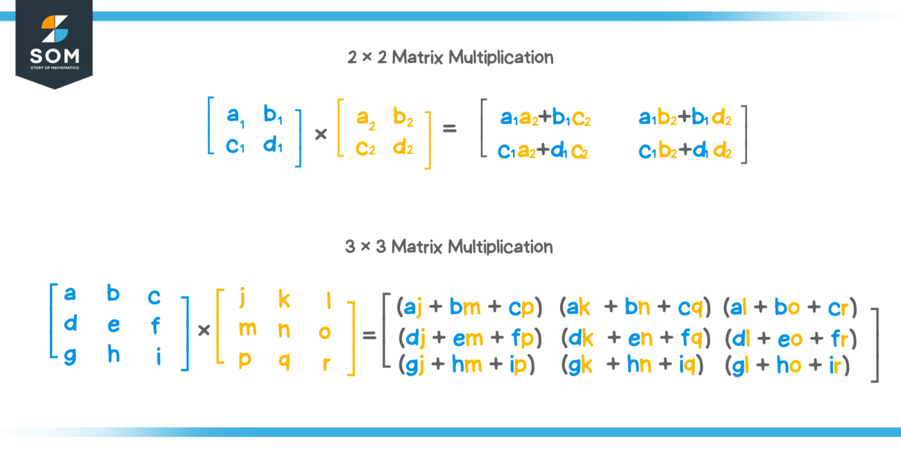
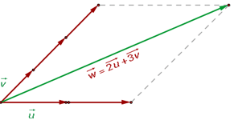
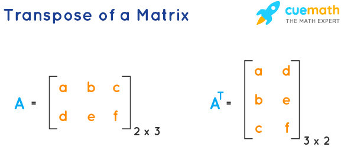

# ft_matrix

It is the study of vector spaces, which consist of objects called vectors. Tranformations
of vectors, called linear maps, are generally represented as objects called "matrices" in
the most usual (finite-dimensional) case. There also exist other, more complex, kinds
of vector spaces: like real or complex polynomials, and function spaces. Linear algebra
allows us to study these diverse subjects within a unifying framework. This makes the
more complicated cases easier to understand, since their properties are generally the same
as the simple cases, and so you can use the simple cases to mentally visualize what would
happen in the complicated ones. For this reason, we will concentrate on the fundamental
case of finite-dimensional vectors and matrices, with an emphasis on 2D and 3D, which
can easily be visualized.

If the mathematical operation is nonsensical (ie, summing a vector and a scalar, or vectors of different sizes), the result is undefined.
### Should i put an exception or nothing ?

### TODO:
- exercise 04 is it ok if there is a different format for the print ?
- [ ] make the functions in "Code constraints" ?
- [ ] make a function called "from" ? ex00
- [ ] for "dot function" should i change self or just return the result ?

# 0. Multiply

[Source](https://www.mathsisfun.com/algebra/matrix-multiplying.html)

* The number of columns of the 1st matrix must equal the number of rows of the 2nd matrix.
* And the result will have the same number of rows as the 1st matrix, and the same number of columns as the 2nd matrix.

# 1. Linear combination

[Source](https://www.superprof.co.uk/resources/academic/maths/analytical-geometry/vectors/linear-combination-of-vectors.html)

# 2. Linear interpolation

The linear interpolation formula is used for data forecasting, data prediction, mathematical and scientific applications and, market research, etc.

[Source](https://www.toppr.com/guides/maths-formulas/linear-interpolation-formula/)

# 3. Dot product

Product of two vectors

[Source](https://www.mathsisfun.com/algebra/vectors-dot-product.html)

# 4. Norm

## A. Taxicab norm or Manhattan norm
[Source](https://fr.wikipedia.org/wiki/Distance_de_Manhattan)
## B. Euclidean norm
[Source](https://www.sciencedirect.com/topics/mathematics/euclidean-norm)
## C. supremum norm
The supremum norm, also known as the infinity norm or max norm, is a mathematical concept used to measure the "size" or "magnitude" of a mathematical object, such as a vector or a function. It is denoted as ||x||∞, where x represents the object in question.

For a vector x = [x₁, x₂, ..., xn], the supremum norm is defined as:

||x||∞ = max(|x₁|, |x₂|, ..., |xn|)

In other words, it is the maximum absolute value of any element in the vector. It quantifies how large the largest element of the vector is, regardless of its position.

# 5. Cosine

Calculate Cosine with Norm

# 6. Cross product

[Source](https://www.mathsisfun.com/algebra/vectors-cross-product.html)

# 7. Linear Transformation
Check 0. its Product of matrix.

# 8. Trace
compute the trace of a matrix, i.e. the sum of the diagonal elements.

# 9. Transpose

# 10. Row Echelon Form

[Row Echelon](https://saturncloud.io/blog/reducing-a-matrix-to-row-echelon-form-using-numpy-a-comprehensive-guide/)

[Theory](https://www.auto-math.be/public/8/module/16/theorie/65)

[Theory on Matrix](https://bouquinpython.readthedocs.io/fr/latest/matrices.html)

[Gaussian Elimination Using Pivot](https://www.delftstack.com/fr/howto/python/gaussian-elimination-using-pivoting/)

[Using Pivot in Python](http://desaintar.free.fr/python/cours/pivot.pdf)

# 11. Determinant

Il s'agit donc d'effectuer tous les produits possibles en prenant un élément par ligne et par colonne dans la matrice, de les multiplier tantôt par +1 tantôt par –1, et de faire la somme des n! termes ainsi obtenus. Cette affectation (+1 ou –1) fait intervenir le nombre d'inversions de la permutation, c'est-à-dire le nombre de paires parmi les termes du produit où l’élément de gauche dans la matrice est situé plus bas que l'élément de droite. Si ce nombre est impair, le produit est multiplié par –1, sinon il est multiplié par +1.

Il y a six produits à calculer en prenant un terme par ligne et par colonne :

* Le produit (–2)(1)(–1) est précédé de + car dans toutes les paires, le terme de gauche est au-dessus de celui de droite ;
* le produit (–2)(0)(3) est précédé du signe – car il existe une seule paire, la paire {0;3}, où le terme de gauche est sous le terme de droite ;
* le produit (–1)(2)(–1) précédé de – car il existe une seule paire, {–1;2}, où le terme de gauche est sous celui de droite ;
* le produit (–1)(0)(–3) précédé de + à cause des paires {–1;–3} et {0;–3} ;
* le produit (4)(2)(3) précédé de + à cause des paires {4;2} et {4;3} ;
* et le produit (4)(1)(–3) précédé de – à cause des trois paires {4;1}, {4;–3} et {1;–3}.

[HEC: Cofactor, minor, Laplace Formula](https://www.hec.ca/cams/rubriques/Les_determinants_des_matrices.pdf)

[Determinant](http://gilles.dubois10.free.fr/algebre_lineaire/evaldet.html)

The determinant of a square matrix represents several geometric and algebraic properties of the linear transformation defined by that matrix. Here are some key aspects of what the determinant describes geometrically and algebraically:

**Scaling Factor**: Geometrically, the determinant represents the scaling factor of the linear transformation. It tells you how much the transformation expands or contracts volumes in the vector space. If the determinant is positive, it indicates an expansion (stretching), and if it's negative, it indicates a contraction (flipping and stretching).

**Orientation**: The sign of the determinant also represents whether the linear transformation preserves or reverses the orientation of vectors in the vector space. A positive determinant preserves orientation, while a negative determinant reverses it.

**Collinearity**: A determinant of zero indicates that the linear transformation collapses vectors onto a lower-dimensional subspace or line. This means that some vectors become collinear after the transformation.

**Invertibility**: A matrix is invertible (i.e., has an inverse) if and only if its determinant is nonzero. In other words, if the determinant is zero, the linear transformation collapses some portion of the vector space onto a lower-dimensional subspace, making it non-invertible.

**Area and Volume**: In two-dimensional space (2D), the determinant represents the area scaling factor, while in three-dimensional space (3D), it represents the volume scaling factor.

**Eigenvalues**: The determinant is related to the eigenvalues of the matrix. Specifically, the product of the eigenvalues equals the determinant.

**Change of Variables**: In multivariable calculus, the determinant plays a crucial role in the change of variables formula when transforming integrals from one coordinate system to another.

In summary, the determinant of a matrix provides information about how the associated linear transformation affects the geometry of the vector space. It tells us about scaling, orientation, collinearity, and invertibility. It is a fundamental concept in linear algebra and has applications in various fields, including computer graphics, physics, and engineering

# 12. Inverse

There is 3 rules to find the inverse of a matrix:
* must be square
* the determinant must be different from 0

[Inverse](https://www.youtube.com/watch?v=wOlG_fnd3v8&list=PL3WoIG-PLjSv9vFx2dg0BqzDZH_6qzF8-&index=3)

[Source](https://www.mathsisfun.com/algebra/matrix-inverse.html)

# 13. Rank

[rank](https://www.nagwa.com/fr/explainers/402106373582/)

[course](https://math.univ-cotedazur.fr/~walter/L1_Info/Cours_rang.pdf)

Le rang d'une matrice échelonnée, réduite ou non, est le nombre de lignes possédant un pivot (non nul). C'est également le rang de la matrice initiale, les opérations de réduction ci-dessus conservant chacune le rang.